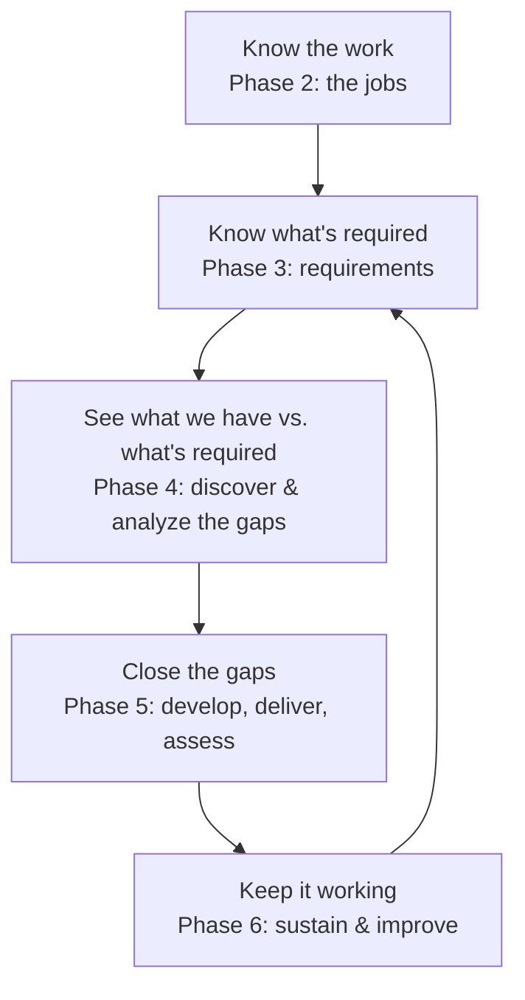

🏠 [Home](../README.md)

# Phase 1 · Overview

*Start here. This phase explains what the whole program is for, who it serves, and the words
you'll need — before any of the detailed work.*

## What we're trying to accomplish
Tyonek is a family of companies (called **subsidiaries**) that do highly regulated work for the
U.S. government — building aircraft and missile parts, maintaining military aircraft, running
cybersecurity and special-operations support, and constructing federal facilities.

In work like this, **people must be trained and certified to do their jobs** — by law, by safety
rules, and by the contracts Tyonek signs. If someone isn't properly trained, it means a safety
risk, a failed audit, and potentially a lost contract. This program exists to:

1. Know **what training every job requires** — and why.
2. Make sure people **actually have it** and can prove it.
3. Give people a **career path** (apprentice → journeyman → master).
4. **Keep improving** the whole system over time.

## How the program works (the lifecycle)

## The companies
Tyonek's four subsidiaries are the *scope* of the program. In this repo the jobs are grouped by
**trade/discipline** (not by company), but every job notes which company it belongs to. See
[The-Companies.md](The-Companies.md) for a short profile of each.

## Key words (plain-language glossary)
| Word | What it means here |
| --- | --- |
| **Subsidiary / company** | One of the four companies under the Tyonek umbrella |
| **Work process / job** | A specific type of work (e.g., welding, aircraft maintenance) |
| **Discipline** | A family of related jobs (e.g., all quality roles), how the jobs are grouped here |
| **Certification** | Official proof a person is qualified for a task — often required by law or contract |
| **Competency** | Proof someone can actually *do* the task, not just that they attended a class |
| **Required / Recommended / Nice-to-have** | How essential a certification is. **Required** = the law or a contract demands it |
| **Apprentice → Journeyman → Master** | A career ladder from beginner to expert |
| **Gap** | The difference between what's *required* and what people *currently* have |
| **DMAIC** | A Lean Six Sigma method used in Phase 4: Define, Measure, Analyze, Improve, Control |

---
◀ *You're at the start* · **Next ▶** [Phase 2 · The Jobs](../2-The-Jobs/)
