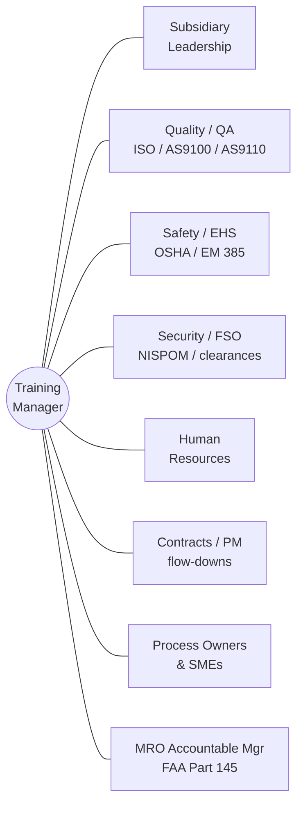

⬅ **Back:** [0 · Start Here](README.md)

---

# 1 · Define

**DMAIC — Define.** Set the boundaries of the discovery: why we're doing it, what's in scope,
who's involved, and what "good" looks like. Nothing is measured or judged yet.

> **(Assumption)** Titles and org structure below are assumed until confirmed on day one.

## Project charter
| Element | Statement |
| --- | --- |
| **Problem / opportunity** | Training and qualification are spread across four regulated, government-contract subsidiaries with no single verified view of current state — creating compliance and readiness risk. |
| **Goal** | Produce a verified, prioritized current-state baseline of training across all subsidiaries and 46 work processes. |
| **Scope (in)** | All subsidiaries; required + recommended training; records, materials, systems, delivery, competency verification. |
| **Scope (out)** | Rebuilding programs or buying systems (that follows Analyze/Improve); performance management of individuals. |
| **Deliverable** | A Discovery Charter (this page) → feeding Measure/Analyze. |

## Voice of the Customer → Critical to Quality (CTQ)
What stakeholders actually need from training — the measurable "quality" targets we'll assess against.
| Voice of the Customer | Critical to Quality (CTQ) |
| --- | --- |
| "We must pass audits" (leadership, QA, customers) | 100% of required training current & evidenced |
| "People must be safe and qualified to do the task" | Competency verified, not assumed |
| "We need to keep and grow skilled people" | Visible Apprentice → Journeyman → Master pathways |
| "Training must match what our contracts require" | Every requirement traces to a contract/regulation |

## SIPOC — the training program at a glance
| Suppliers | Inputs | Process | Outputs | Customers |
| --- | --- | --- | --- | --- |
| Regulators, customers, contracts, cert bodies, subsidiary leaders | Requirements, people, materials, records, budget | Identify requirement → develop/deliver training → assess competency → document → audit | Qualified personnel, records, compliance evidence | Subsidiaries, contract customers, auditors, employees |

## Stakeholder map

## Define-phase checklist
- ▢ Charter agreed with leadership (scope, goal, CTQs)
- ▢ Stakeholders identified and access requested
- ▢ Success measures (CTQs) written and measurable
- ▢ Open-questions / assumptions log started

**Output:** an agreed Discovery Charter and stakeholder map — the basis for data collection.

---

**Next ➡** [2 · Measure](2-Measure.md)
