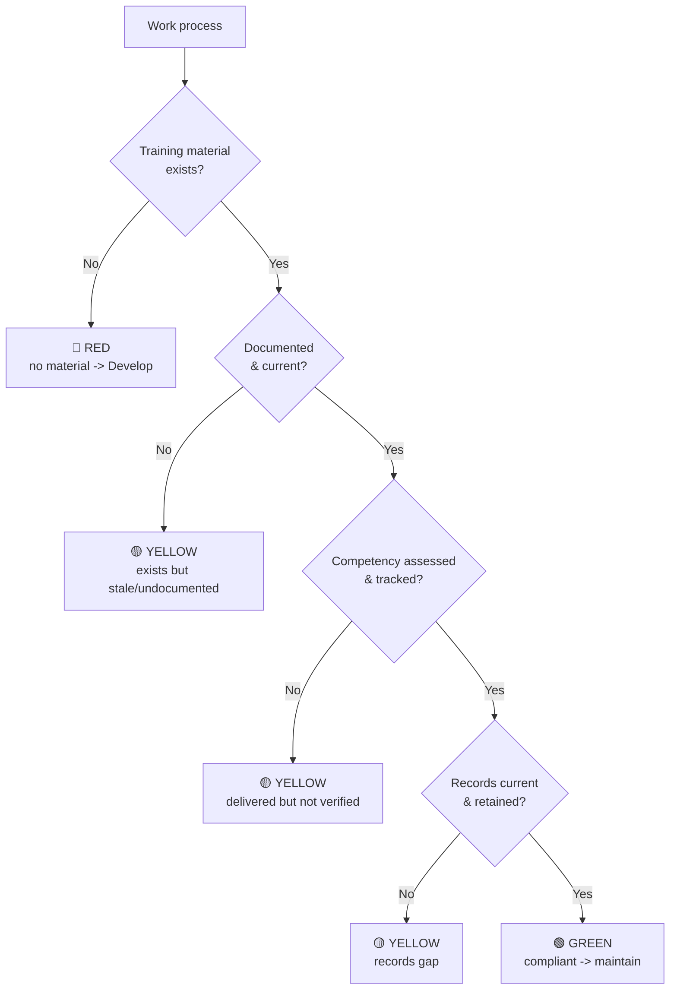

⬅ **Back:** [2 · Measure](2-Measure.md)

---

# 3 · Analyze

**DMAIC — Analyze.** Turn the raw data into insight: rate what exists, find the gaps and their
**root causes**, and separate the **vital few** high-impact issues from the trivial many.

## Step 1 — Rate each work process (triage → RAG)
Run each of the 46 work processes through this decision tree and assign a color.

| Rating | Meaning | Typical next step |
| --- | --- | --- |
| 🟢 **Green** | Exists, current, assessed, recorded | Maintain; put in the improvement loop |
| 🟡 **Yellow** | Exists but has a gap (stale, unverified, poorly recorded) | Fix the specific weakness |
| 🔴 **Red** | No training for a required item | Develop (or urgently source) |

## Step 2 — Prioritize the vital few (Pareto thinking)
Not all gaps are equal. Rank by **risk × reach**:
- **Risk** = compliance/contract/safety exposure if the gap persists.
- **Reach** = how many people / processes / contracts it touches.

Focus first on the ~20% of gaps driving ~80% of the risk — typically **Red** items on
regulatory or contract-flowed requirements (e.g., a lapsed FAA/OSHA/security qualification).

## Step 3 — Root-cause the systemic gaps (5 Whys)
For recurring/systemic gaps, don't just fix the symptom — find the cause.
> *Example (illustrative):* "Respirator training lapsed" → why? no expiration tracking → why?
> tracked in a spreadsheet nobody owns → why? no standard process → **root cause: no
> owned, systematic tracking.** Fix the system, not just the one record.

Common root-cause categories (fishbone starters): **People** (no owner), **Process** (no
standard work), **Records** (no tracking/retention), **Materials** (no content), **Systems**
(no LMS/reminders), **Requirements** (never verified against contract).

## Step 4 — Separate quick wins from projects
| Type | Definition | Handling |
| --- | --- | --- |
| **Quick win** | Low effort, high value (e.g., record a training that already happened) | Do now |
| **Systemic project** | Needs design/build (e.g., create missing courseware, stand up tracking) | Plan into Improve |
| **Immediate risk** | Someone doing regulated work unqualified | **Escalate now** — don't wait |

## Analyze-phase checklist
- ▢ All processes RAG-rated
- ▢ Gaps ranked by risk × reach (vital few identified)
- ▢ Root causes found for systemic gaps
- ▢ Quick wins, projects, and immediate risks separated

**Output:** a prioritized current-state gap analysis, ready to turn into recommendations.

---

**Next ➡** [4 · Improve](4-Improve.md)
