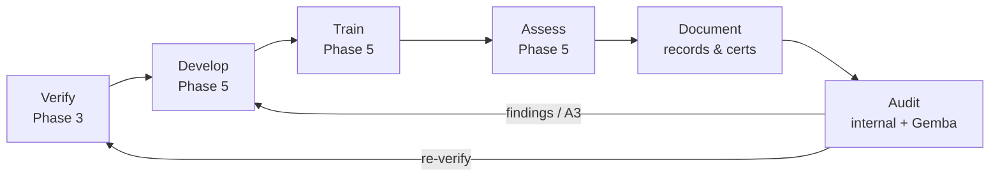

🏠 [Home](../README.md)

# Phase 6 · Sustain & Improve

*Keep the program working over time. Document what people are qualified for, audit that the
system holds, and continuously improve — so the gains from Phases 4–5 don't decay.*

## The continuous-improvement loop
[Continuous-Improvement-Loop.md](Continuous-Improvement-Loop.md) is the engine that runs the
whole standing program: **Verify → Develop → Train → Assess → Document → Audit** (PDCA). Phases
3–5 map onto its stages; this phase owns **Document** and **Audit** and the improvement cycle.

## Templates
| File | Purpose |
| --- | --- |
| [templates/Internal-Training-Audit-Checklist.md](templates/Internal-Training-Audit-Checklist.md) | Quarterly audit questions + finding routing |
| [templates/Corrective-Action-A3.md](templates/Corrective-Action-A3.md) | One-page lean A3 for systemic gaps |

## What "good" looks like (KPIs)
Certification currency %, training-completion %, first-pass competency rate, time-to-qualify,
open audit findings & closure time, apprentices advancing tiers, retention / fill rates.

## The cycle never ends
New contracts, standard revisions, and audit findings re-trigger [Phase 3](../3-Requirements/)
and [Phase 4](../4-Discover-and-Analyze/) for the affected area — the program stays current.

---
◀ [Previous: Phase 5 · Develop · Deliver · Assess](../5-Develop-Deliver-Assess/) · **Back to** [Home](../README.md)
