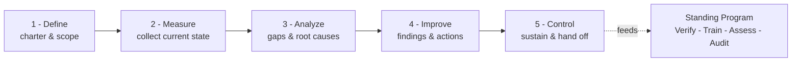
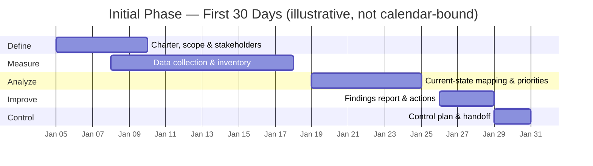

🏠 [Home](../README.md) · *Guided Tour — Stop 4: Discover the Current State*

---

# Initial — Current-State Discovery (Lean Six Sigma / DMAIC)

The **Initial phase** is how I'd learn what the company already has for training across every
subsidiary — *before changing anything*. It's structured as a **Lean Six Sigma DMAIC project**:
**Define → Measure → Analyze → Improve → Control.** Work through the documents in order; each
links to the next at the bottom and back to the previous at the top.

> **On assumptions:** without Tyonek's internal data, parts of this framework make reasonable
> assumptions — each is flagged **(Assumption)**. They're day-one questions to confirm, not
> conclusions. This is a reference framework we'll refine together.

## DMAIC flow

## How the phases map to the work
| DMAIC phase | In this project | Output |
| --- | --- | --- |
| **Define** | Charter the discovery: purpose, scope, stakeholders, what "good" means (CTQ) | Discovery charter + SIPOC |
| **Measure** | Collect current-state data (records, materials, systems) — no judging yet | Current-state inventory |
| **Analyze** | Rate each process, find gaps and root causes, prioritize the vital few | Prioritized gap analysis |
| **Improve** | Recommend actions, quick wins vs. projects, findings report | Initial Findings Report |
| **Control** | Sustain via the standing continuous-improvement loop | Control plan + handoff |

## Illustrative first-30-days timeline

## Documents (work through in order)
| # | Document |
| --- | --- |
| 1 | [Define](1-Define.md) |
| 2 | [Measure](2-Measure.md) |
| 3 | [Analyze](3-Analyze.md) |
| 4 | [Improve](4-Improve.md) |
| 5 | [Control](5-Control.md) |

---

**Start ➡** [1 · Define](1-Define.md)

*Or skip ahead in the main tour:* ▶ **[Stop 5 — Program-Management](../Program-Management/)**
