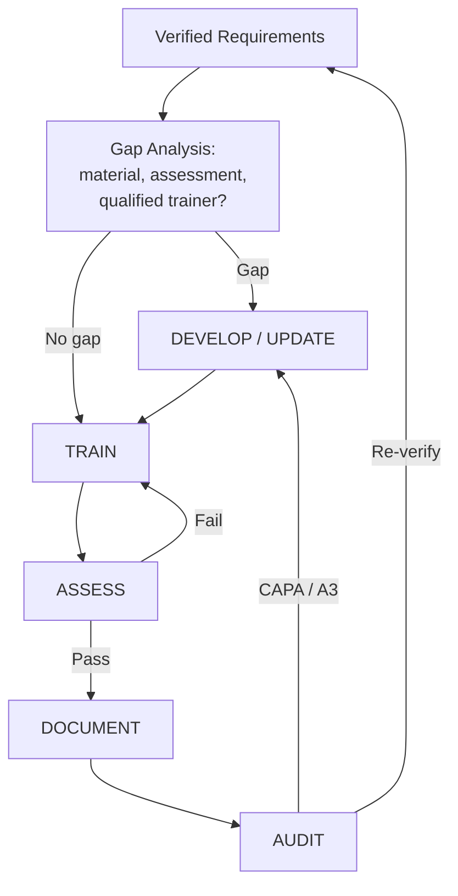

# 02 — Continuous Improvement Loop (Train → Assess → Document → Audit)

**Purpose:** Keep every person qualified to the **verified** requirements and improve the
program continuously over time. The loop is a single **PDCA** cycle with a gap-driven
**Develop** branch so training material is created wherever a requirement has none.

**Inputs:** the verified Requirements Register from `01-Requirements-Verification-Process.md`.

---

## Stage 0 — Gap Analysis (Plan)
For each verified requirement, ask: **Does standardized training content, an assessment
method, and a qualified trainer already exist?** Use the *Training Needs / Gap Analysis*
template. Any "no" routes to **Develop**. Any "yes" proceeds to **Train**.

## Stage 1 — DEVELOP / UPDATE (Plan) — *the "if not already implemented" branch*
Create or refresh the missing deliverable using **ISD / ADDIE** (leverage Mission Support's
in-house ISD capability):
1. **Analyze** — define the competency and learning objectives tied to the requirement and to
   the trade's journey level (Apprentice/Journeyman/Master).
2. **Design** — outline content, delivery method (OJT, classroom, eLearning), and the
   **assessment** (knowledge check + practical demonstration).
3. **Develop** — build the training doc (extend the existing `README.md` template), job aids,
   and the assessment instrument.
4. **Implement (pilot)** — run a pilot cohort; capture feedback.
5. **Evaluate & release** — approve, version, and commit to the repo as the new **standard work**.

*Lean:* new material is not "done" until it is standardized, version-controlled, and repeatable.

## Stage 2 — TRAIN (Do)
Deliver the standardized training to the standard. Blend **on-the-job learning** with
**related technical instruction** (mirrors the apprenticeship structure in
`TRADE-PROGRESSION.md`). Record attendance and delivery against the plan.

*Lean:* Standard Work + Heijunka — level the training load so qualification keeps pace with
staffing and contract demand rather than lurching from crisis to crisis.

## Stage 3 — ASSESS (Check)
Verify competency, don't assume it:
- **Knowledge check** (written/oral) + **practical demonstration** observed by a qualified evaluator.
- **Pass** → proceed to Document and, where applicable, advance the journey-level tier.
- **Fail** → return to Train (targeted retraining); log the reason to inform material improvement.

*Lean:* Jidoka — competency is the quality gate; do not pass work forward until it is verified.

## Stage 4 — DOCUMENT (Act / record)
- Record competency in the **training matrix** (people × requirements) and individual records.
- Issue/track certifications with **expiration dates** and renewal drivers.
- Maintain traceability: person → competency → requirement → contract clause.
- Retain records per contract/regulatory retention rules (auditable evidence).

*Lean:* Visual management — a color-coded matrix (green current / yellow expiring / red
gap) makes status obvious at a glance; poka-yoke prevents assigning expired-cert personnel.

## Stage 5 — AUDIT (Check the system)
Periodic internal audits confirm the *system* is working, not just individuals:
- Are personnel trained to the **current verified** requirements?
- Are records complete, certs current, evidence retained?
- Does documented standard work match observed work (**Gemba**)?
- Findings → **Corrective Action / A3** → improvements routed back to **Develop** (fix
  material) and/or **Verify** (re-check the requirement). Use the *Internal Training Audit
  Checklist* and *Corrective-Action A3* templates.

*Lean:* Kaizen + A3 — every finding is a small improvement opportunity, tracked to closure.

---

## Lean tool mapping
| Loop element | Lean tool / principle |
| --- | --- |
| Whole loop | PDCA (Plan-Do-Check-Act) |
| Verify / Gap analysis | Go-and-see (Gemba), value-stream focus |
| Develop | Standard Work creation, ISD/ADDIE, Kaizen |
| Train | Standard Work, Heijunka (level loading) |
| Assess | Jidoka (build-in quality), first-time-right |
| Document | Visual management, Poka-yoke (expiry control) |
| Audit | Gemba, A3 problem solving, CAPA, Kaizen |
| Progression | Respect for people (career pathways, retention) |

## KPIs (measure to improve)
| Metric | What it tells you | Target direction |
| --- | --- | --- |
| Training completion % (vs. required) | Coverage of the workforce | ↑ toward 100% |
| Certification currency % | Compliance / audit readiness | ↑ toward 100% |
| Competency assessment first-pass rate | Training effectiveness | ↑ (low = fix material) |
| Time-to-qualify (new hire → journey) | Pipeline speed | ↓ |
| Open audit findings & mean closure time | System health | ↓ |
| Apprentices advancing tier / year | Progression & retention | ↑ |
| Requirements verified within cadence % | Baseline integrity | ↑ toward 100% |

## Cadence (operating rhythm)
| Frequency | Activity |
| --- | --- |
| Daily | Expiring-certification andon; qualification checks before task assignment |
| Weekly | Training completion tracking; retraining follow-ups |
| Monthly | KPI review with process owners; material updates from feedback |
| Quarterly | Internal training audit (rotating subset of processes); CAPA review |
| Annually | Full requirements re-verification + management review (feeds ISO 9001 / AS9100 review) |

## Governance
The Training Manager owns the loop and reports KPIs into the quality **management review**
(ISO 9001 / AS9100 / AS9110). Systemic or high-risk gaps are escalated with an A3; contract
compliance risks are escalated to Contracts/PM immediately.
