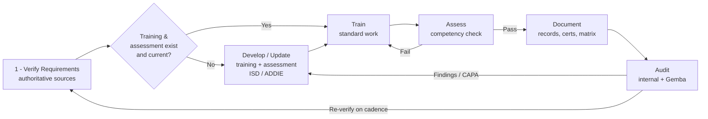

# Program Management — Training Verification & Continuous Improvement

This area defines **how the training program actually runs** across all four Tyonek
subsidiaries and their 46 work processes. It converts the reference material in the
subsidiary folders (training docs, `CERTIFICATIONS.md`, `TRADE-PROGRESSION.md`) into a
living, verifiable, continuously-improving system built on **lean principles**.

It answers two questions:

1. **Are the requirements real?** — a process to verify every actual requirement across
   the board against authoritative sources (contracts, regulation, standards, cert bodies).
2. **How do we keep people qualified and improve over time?** — a closed-loop
   **Train → Assess → Document → Audit** cycle, with a branch to **Develop new training**
   wherever a verified requirement has no material yet.

## The loop at a glance

*Verify* sets true north. *Develop* fills gaps. *Train → Assess → Document* qualifies people.
*Audit* proves the system works and feeds improvements back in. The cycle never stops — that
is the continuous-improvement engine (PDCA).

## Documents in this area
| File | Purpose |
| --- | --- |
| [01-Requirements-Verification-Process.md](01-Requirements-Verification-Process.md) | Verify actual requirements for every work process against authoritative sources |
| [02-Continuous-Improvement-Loop.md](02-Continuous-Improvement-Loop.md) | The Train → Assess → Document → Audit loop, Develop branch, lean-tool mapping, KPIs, cadence |

### Templates (fillable forms that make the process runnable)
| File | Purpose |
| --- | --- |
| [Requirements-Verification-Register.md](templates/Requirements-Verification-Register.md) | One row per requirement; verify source, citation, applicability, and classification |
| [Training-Needs-Gap-Analysis.md](templates/Training-Needs-Gap-Analysis.md) | Plain-language primer **+ a catalog of the governing material that mandates training** (OSHA, AS9100/AS9110, FAA Part 145, DoD, EM 385-1-1, etc.) + gap worksheet |
| [Competency-Assessment-Record.md](templates/Competency-Assessment-Record.md) | Knowledge check + practical demonstration sign-off (the competency gate) |
| [Internal-Training-Audit-Checklist.md](templates/Internal-Training-Audit-Checklist.md) | Quarterly audit questions + finding routing |
| [Corrective-Action-A3.md](templates/Corrective-Action-A3.md) | One-page lean A3 for systemic gaps |

### Worked examples
See [examples/](examples) for a completed **Welding** Requirements Register and Gap Analysis —
a concrete demonstration of what the templates look like filled in.

## How this uses lean
- **PDCA (Plan-Do-Check-Act):** the whole loop is one continuous PDCA cycle.
- **Standard Work:** each training doc + assessment is the standard; deviations are visible.
- **Jidoka (build quality in):** stop-the-line when someone isn't qualified — don't let
  unqualified work proceed (poka-yoke on expired certifications).
- **Gemba:** verification and audit both require going to where the work happens.
- **Kaizen / A3:** audit findings and metric gaps drive small, continuous improvements.
- **Respect for people:** the Apprentice → Journeyman → Master pathways give every trade a
  visible growth path, supporting retention and recruiting.

## Internal capability note
Tyonek Mission Support's **Instructional Systems Design (ISD / ADDIE)** value stream is an
in-house capability that can build or refresh the "Develop new training" deliverables for
the other subsidiaries — an internal center of excellence for courseware.

## Roles (RACI summary)
| Role | Responsibility in the loop |
| --- | --- |
| **Training Manager (program owner)** | Owns the process, cadence, metrics, and management review |
| **Process Owner / SME (per work process)** | Verifies requirements, delivers/validates training, signs competency |
| **Contracts / Program Management** | Confirms contract/SOW-flowed requirements |
| **Quality (QA)** | Standards mapping, internal audits, CAPA |
| **Security (FSO)** | Clearance, NISPOM, COMSEC, controlled-material training requirements |
| **Human Resources** | Records retention, apprenticeship registration, OFCCP compliance |
