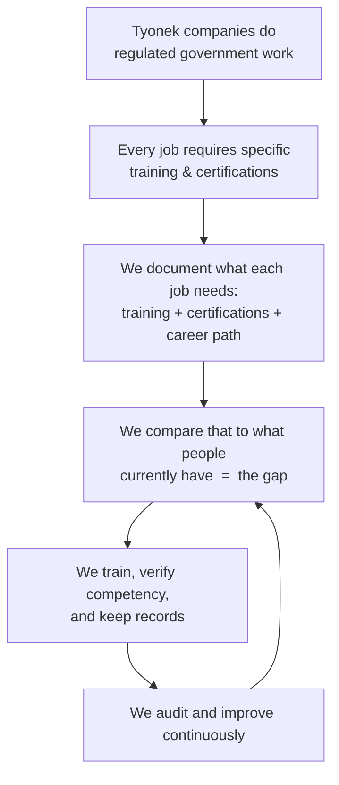

# Tyonek Training Program

**In one sentence:** a complete system for making sure every employee across Tyonek's companies
has the training and certifications their job requires — and stays qualified over time.

*New here and don't have a training background? You're in the right place. Read this page top to
bottom, then follow the **Guided Tour** below in order.*

---

## What we're trying to accomplish

Tyonek is a family of companies (called **subsidiaries**) that do highly regulated work for the
U.S. government — building aircraft and missile parts, maintaining military aircraft, running
cybersecurity and special-operations support, and constructing federal facilities.

In work like this, **people must be trained and certified to do their jobs** — by law, by safety
rules, and by the contracts Tyonek signs. If someone isn't properly trained, it means a safety
risk, a failed audit, and potentially a lost contract.

This repository is the **plan and toolkit** for managing all of that. It exists to:

1. Know **what training every job requires** — and why.
2. Make sure people **actually have it** and can prove it.
3. Give people a **career path** (apprentice → journeyman → master).
4. **Keep improving** the whole system over time.

## The big picture



---

## Guided Tour — follow these in order

Each stop has its own plain-language overview page. This is the path to actually *understand*
the program.

| Step | Go to | What you'll learn |
| --- | --- | --- |
| **1. The companies** | [the four companies below](#the-companies) | Who the subsidiaries are and the work they do |
| **2. One job up close** | [Welding (example)](Tyonek-Manufacturing-Group/Value-Stream/03-Welding/) | What a *single* job's training, certifications, and career path look like |
| **3. Every job at a glance** | [TRADE-INDEX.md](TRADE-INDEX.md) | All 46 jobs and their trades/apprenticeship paths on one page |
| **4. How we run it — Part 1: Discover** | [Initial/](Initial/) | How we learn what training the company *already has* (a step-by-step project) |
| **5. How we run it — Part 2: Operate & improve** | [Program-Management/](Program-Management/) | The ongoing loop: verify → train → assess → document → audit |
| **6. Reference library** | [References/](References/) | The rules & standards that require training, and where to find them |

---

## Key words (plain-language glossary)

| Word | What it means here |
| --- | --- |
| **Subsidiary** | One of the companies under the Tyonek umbrella |
| **Work process** | A specific job or type of work (e.g., welding, aircraft maintenance) |
| **Certification** | Official proof a person is qualified for a task — often required by law or contract |
| **Competency** | Proof someone can actually *do* the task, not just that they attended a class |
| **Required / Recommended / Nice-to-have** | How essential a certification is. **Required** = the law or a contract demands it |
| **Value stream** | The core steps that turn raw work into the product or service the customer pays for |
| **Apprentice → Journeyman → Master** | A career ladder from beginner to expert |
| **Gap** | The difference between what's *required* and what people *currently* have |
| **DMAIC** | A Lean Six Sigma method used in the Discover phase: Define, Measure, Analyze, Improve, Control |

---

## How every job is documented

Each of the **46 work processes** has its own folder containing the same three files:

- **`README.md`** — the *training document* (what the job is, how it's done safely, sign-off)
- **`CERTIFICATIONS.md`** — the *certifications* the job needs (Required / Recommended / Nice-to-have)
- **`TRADE-PROGRESSION.md`** — the *career path* (the trade + apprentice → journeyman → master)

Within each company, jobs are grouped using **lean principles**: the value-adding work sits in
flow order under `Value-Stream/`, and the support functions sit under `Support-Processes/`.

## Repository map

```
Tyonek-Training/
├── README.md            ← you are here (start)
├── TRADE-INDEX.md       all 46 jobs + trades on one page
├── Initial/             Part 1: how we DISCOVER the current state (DMAIC)
├── Program-Management/  Part 2: how we OPERATE & improve the program
├── References/          the rules/standards library + official links
└── Tyonek-*/            the four companies, each with its work-process folders
    ├── Value-Stream/        core value-adding jobs (in flow order)
    │   └── NN-<Job>/  →  README + CERTIFICATIONS + TRADE-PROGRESSION
    └── Support-Processes/   enabling jobs
        └── <Job>/     →  README + CERTIFICATIONS + TRADE-PROGRESSION
```

## The companies

| Folder | Company | What they do |
| --- | --- | --- |
| [`Tyonek-Manufacturing-Group`](Tyonek-Manufacturing-Group/) | Tyonek Manufacturing Group, Inc. | Aerospace/defense parts & assemblies (Manufacturing) |
| [`Tyonek-Services-Group`](Tyonek-Services-Group/) | Tyonek Services Group, Inc. | Aircraft maintenance, repair & overhaul (MRO) |
| [`Tyonek-Mission-Support`](Tyonek-Mission-Support/) | Tyonek Services Group, Inc. | Cyber, training & special-operations support |
| [`Tyonek-Contractor-Services`](Tyonek-Contractor-Services/) | Tyonek Contractor Services, LLC | Federal construction / general contracting |

---

*A working model of a Tyonek training program, built from public information and public
standards. It shows both the structure of the program and how it would be run.*
