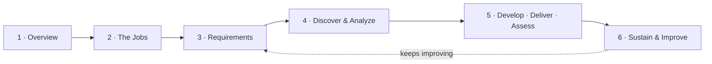

# Tyonek Training Program

**In one sentence:** a complete system for making sure every employee across Tyonek's companies
has the training and certifications their job requires — and stays qualified over time.

This repository is organized as the **training-program lifecycle** — the actual sequence a
training manager works through, from understanding the work to keeping the program improving.
Follow the phases in order.

## The lifecycle

## Work through it in order

| Phase | Folder | What it covers |
| --- | --- | --- |
| **1 · Overview** | [1-Overview/](1-Overview/) | Why the program exists, the companies, how it all works, and a glossary |
| **2 · The Jobs** | [2-The-Jobs/](2-The-Jobs/) | The 46 jobs we train — grouped by trade/discipline — each with its training doc, certifications, and career path |
| **3 · Requirements** | [3-Requirements/](3-Requirements/) | What training the law and contracts *require*, and how we verify it |
| **4 · Discover & Analyze** | [4-Discover-and-Analyze/](4-Discover-and-Analyze/) | Learn what the company already has, and find the gaps (Lean Six Sigma DMAIC) |
| **5 · Develop · Deliver · Assess** | [5-Develop-Deliver-Assess/](5-Develop-Deliver-Assess/) | Build missing training, deliver it, and verify competency |
| **6 · Sustain & Improve** | [6-Sustain-and-Improve/](6-Sustain-and-Improve/) | Document, audit, and continuously improve the program |

## New here, with no training background?
Start at **[1-Overview](1-Overview/)** — it explains what we're trying to accomplish in plain
language, defines every key term, and shows how the six phases fit together. Then keep clicking
**Next ▶** at the bottom of each phase.

## Using AI to accelerate this
See **[AI-Assist Strategy](1-Overview/AI-Assist-Strategy.md)** for where AI can speed up building
and running the program — and the government-contract guardrails for doing it safely. Each phase
also carries a short 🤖 **AI Assist** note.

---
*A working model of a Tyonek training program, built from public information and public
standards. It shows both the structure of the program and how it would be run.*
